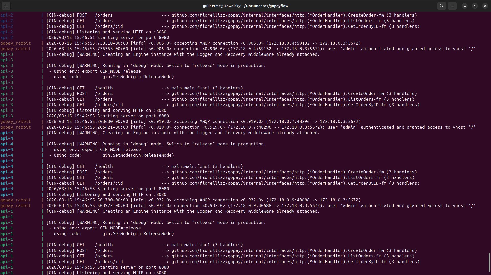
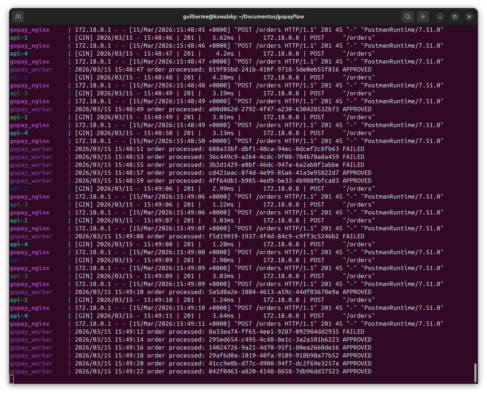

# GoPay

**GoPay** é uma arquitetura backend de processamento de pagamentos construída em **Golang** com foco em **processamento assíncrono**, **escalabilidade horizontal** e **infraestrutura containerizada**.

O projeto simula o fluxo de um **sistema de pagamentos**, separando claramente:

* API de entrada
* balanceamento de carga
* fila de processamento
* workers assíncronos
* banco de dados

O objetivo não é apenas criar uma API, mas **demonstrar uma arquitetura de backend completa**, preparada para crescimento e alto volume de requisições.

---

# Arquitetura do Sistema

O sistema segue o seguinte fluxo:

```
Client (Frontend)
        ↓
   Nginx (Load Balancer)
        ↓
   API (replicas)
        ↓
   PostgreSQL (persistência)
        ↓
   RabbitMQ (fila)
        ↓
---------------------------
        ↓
        Worker
        ↓
 Simulação de pagamento
        ↓
 Atualização do pedido
```

### Explicação

1. O cliente envia uma requisição para criar um pagamento.
2. O **Nginx distribui a carga** entre múltiplas instâncias da API.
3. A **API registra o pedido no banco** com status `PENDING`.
4. A API publica um evento em uma **fila de processamento**.
5. Um **Worker assíncrono** consome a fila.
6. O Worker simula o processamento do pagamento.
7. O Worker atualiza o status do pedido no banco.

Essa arquitetura é amplamente utilizada em sistemas reais de pagamento.

---

# Componentes da Arquitetura

```
|-----------------------------------------------------------|
|                         CLIENT                            |
|-----------------------------------------------------------|
| Web App                                                   |
| Mobile App                                                |
| Sistemas terceiros                                        |
| Integrações REST                                          |
|-----------------------------------------------------------|
                           |
                           |
                           v
|-----------------------------------------------------------|
|                   NGINX LOAD BALANCER                     |
|-----------------------------------------------------------|
| Distribui requisições                                     |
| Balanceamento de carga                                    |
| Alta disponibilidade                                      |
|-----------------------------------------------------------|
                           |
                           |
                           v
|-----------------------------------------------------------|
|                      API LAYER                            |
|-----------------------------------------------------------|
| API Instance 1                                            |
| API Instance 2                                            |
| API Instance 3                                            |
| API Instance 4                                            |
|-----------------------------------------------------------|
| Responsabilidades:                                        |
| - Receber requisições                                     |
| - Validar dados                                           |
| - Criar pagamento                                         |
| - Consultar pagamento                                     |
| - Publicar eventos                                        |
|-----------------------------------------------------------|
                           |
                           |
                           v
|-----------------------------------------------------------|
|                    APPLICATION LAYER                      |
|-----------------------------------------------------------|
| Casos de Uso                                              |
|                                                           |
| CreateOrder                                               |
| GetOrderByID                                              |
| ListOrders                                                |
|                                                           |
| Regras de negócio                                         |
| Orquestração do fluxo                                     |
|-----------------------------------------------------------|
                           |
                           |
                           v
|-----------------------------------------------------------|
|                      DOMAIN LAYER                         |
|-----------------------------------------------------------|
| Entidades do sistema                                      |
|                                                           |
| Order                                                     |
| PaymentStatus                                             |
|                                                           |
| Interfaces (contratos)                                    |
|                                                           |
| OrderRepository                                           |
|-----------------------------------------------------------|
                           |
                           |
                           v
|-----------------------------------------------------------|
|                   INFRASTRUCTURE LAYER                    |
|-----------------------------------------------------------|
| Implementações externas                                   |
|                                                           |
| PostgreSQL Repository                                     |
| RabbitMQ Publisher                                        |
|-----------------------------------------------------------|
            |                             |
            |                             |
            v                             v

|---------------------------|      |---------------------------|
|        POSTGRESQL         |      |          QUEUE            |
|---------------------------|      |---------------------------|
| Persistência de dados     |      | Mensageria assíncrona     |
|                           |      |                           |
| Tabela: orders            |      | RabbitMQ                  |
|                           |      |                           |
| Status do pagamento       |      | Eventos publicados        |
| Histórico                 |      |                           |
|---------------------------|      |---------------------------|
            |                             |
            |                             |
            |                             v
            |                |--------------------------------|
            |                |           MESSAGE BUS          |
            |                |--------------------------------|
            |                | Eventos de pagamento           |
            |                | Eventos de atualização         |
            |                | Processamento desacoplado      |
            |                |--------------------------------|
            |                             |
            |                             |
            v                             v

|-----------------------------------------------------------|
|                         WORKERS                           |
|-----------------------------------------------------------|
| Worker Instance 1                                         |
| Worker Instance 2                                         |
| Worker Instance 3                                         |
|-----------------------------------------------------------|
| Responsabilidades:                                        |
| - Consumir mensagens da fila                              |
| - Processar pagamento                                     |
| - Simular gateway externo                                 |
| - Atualizar status do pedido                              |
|-----------------------------------------------------------|
                           |
                           |
                           v
|-----------------------------------------------------------|
|                   PAYMENT PROCESSOR                       |
|-----------------------------------------------------------|
| Simulação de gateway de pagamento                         |
|                                                           |
| Exemplo de fluxo:                                         |
|                                                           |
| Pedido recebido                                           |
| ↓                                                         |
| Processamento                                             |
| ↓                                                         |
| Resultado aprovado ou falho                               |
|-----------------------------------------------------------|
                           |
                           |
                           v
|-----------------------------------------------------------|
|                      DATABASE UPDATE                      |
|-----------------------------------------------------------|
| Atualização do status do pedido                           |
|                                                           |
| PENDING → APPROVED                                        |
| PENDING → FAILED                                          |
|-----------------------------------------------------------|
                           |
                           |
                           v
|-----------------------------------------------------------|
|                       FINAL STATE                         |
|-----------------------------------------------------------|
| Pedido final armazenado no banco                          |
| Consulta disponível via API                               |
| Histórico persistido                                      |
|-----------------------------------------------------------|
```

---

# API Endpoints

### Criar pedido

```
POST /orders
```

Body:

```
{
  "amount": 100
}
```

Resposta:

```
{
  "id": "uuid"
}
```

---

### Listar pedidos

```
GET /orders
```

---

### Buscar pedido

```
GET /orders/:id
```

---

## Estrutura das APIs



## Visão do Fluxo



# Infraestrutura

Toda a stack roda em containers.

Containers utilizados:

* API
* PostgreSQL
* RabbitMQ
* Migration Runner

---

# Docker Compose

O ambiente pode ser iniciado com:

```
docker compose up --build
```

Serviços disponíveis:

| Serviço     | Porta |
| ----------- | ----- |
| API         | 8080  |
| PostgreSQL  | 5432  |
| RabbitMQ    | 5672  |
| RabbitMQ UI | 15672 |

---

# Benefícios da Arquitetura

* desacoplamento entre API e processamento
* melhor throughput
* resiliência
* facilidade de escalar workers
* APIs stateless
* separação clara de responsabilidades

---

# Objetivo do Projeto

Este projeto demonstra como construir um backend moderno em Go com:

* arquitetura limpa
* mensageria
* processamento assíncrono
* infraestrutura containerizada
* escalabilidade horizontal

Ele serve como **base para sistemas reais de pagamentos ou processamento de eventos**.

---
